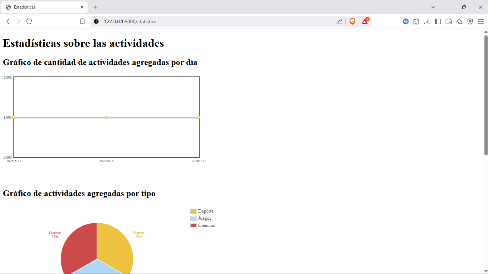
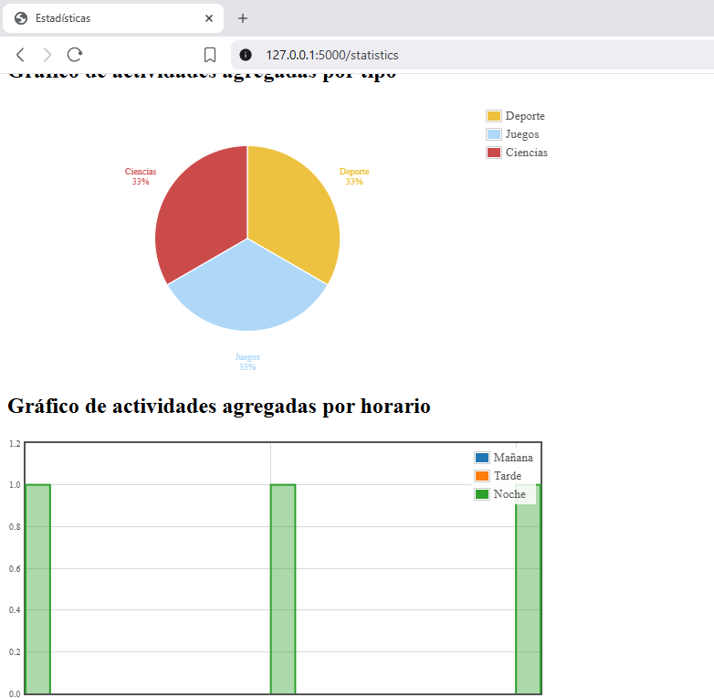

# desarrollo_web_camilo_alvarez Tarea 2
En este documento se explicitarán algunas de las decisiones de la creación del código en JavaScript, Python y lenguajes html y css para la creación de la página web.

-A diferencia de la Tarea 1 en mi entrega, se corrigieron ciertos aspectos relevantes con respecto a las validaciones del frontend. Ahora, es posible ver que las fechas insertadas son validadas por validador.js asegurandose que la fecha de término de una actividad sea después que la de inicio. A su vez se certifica que los atributos requeridos por el formulario sean también satisfechos por el usuario, y en caso de que no, no se hace el envío del formulario.

-La implementación de flask fue muy relevante en la realización de esta tarea, en donde se crearon rutas mediante app.py que reemplazan la necesidad de explicitar las rutas locales de los html. Basta con simplemente indicar la función que define la ruta en donde se muestra el html para que se siga la lógica. Así cada vez que se gatilla la función, se pude trabajar con los métodos POST y GET, además de trabajar con jinja 2 en ambiente html, lo cual fue muy relevante para poder rescatar los elementos provenientes desde el backend. Con respecto a este apartado cabe destacar que si bien en un momento se hizo muy dificil la organización del código debido a la cantidad de funcionalidades que había que tener para preprocesar las cosas provenientes del formulario, luego con la ayuda de la auxiliar 5 y su estructura, se hizo un poco mas compacto y coherente el código, sin embargo, no se pudo trasladar toda la lógica a este formato debido a cuestiones de tiempo.

-En esta entrega se arregló un poco el formato de css y por ende la estética de la pagina web.

-Por otro lado, se hace presente algunas precauciones que se debe tener a la hora de subir actividades.
 1. Las bases de datos van a estar vacías, por ende en la portada no va a mostrar ninguna actividad pues ninguna ha sido añadida.

 2. A la hora de agregar una actividad, procurar agregar Temas, Contactos y Fotos una a la vez, aunque se manejó desde el frontend para que el usuario no pudiese agregar el máximo de inputs o de selects y luego rellenarlos, hay casos en donde esto no fuciona.

 3. Si todos los campos fueron rellenados de forma correcta y el file fue efectivamente subido como una foto (si esto no pasa se hace catch desde el back-end) en la portada se mostrará la actividad agregada.

 4. Será posible también visualiarla en el apartado de lista de actividades, el cual de forma dinámica se va rellenando según la base de datos gracias a la acción de jinja2.

 -Por último cabe mencionar que ninguna de las implementaciones abordadas para los apartados del formulario, lista de actividades o la portada fue también hecha para las estadísticas, apartado el cual, será abordado en la tarea 3.

 # desarrollo_web_camilo_alvarez Tarea 3

 -Se utilizará flot 4.2.2 para la creación de gráficos a través de js. Para esto, se importaron desde github las librerias manualmente y de forma local, igualmente al estar en este repositorio se subirán junto los comandos git add .

 -A pesar de que se tiene jquery en el caso de las promesas de AJAX para js se harán con fetch() debido a que es más moderno y recomendado que XMLHTTTPREQUEST() o JQuery.ajax().

 -!IMPORTANTE! no pude descubrir por qué a la hora de generar los gráficos hay un comportamiento muy variable que tiene que ver tanto con flot como con sql alchemy, los cuales muestran en determinadas ocasiones los gráficos solicitados como se puede ver:

 

-!IMPORTANTE! tampoco pude generar los comentarios de forma dinámica desde js y usando AJAX :c no pude hacer que la función se trigeree de la forma que yo quería. sin embargo basta con hacer flask run para ver las actualizaciones, igual debería funcionar a modo de ejemplo lo que dejé en las bases de este proyecto.